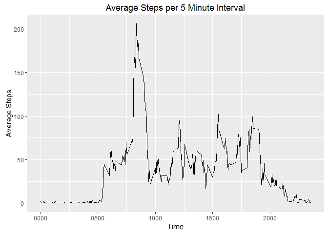
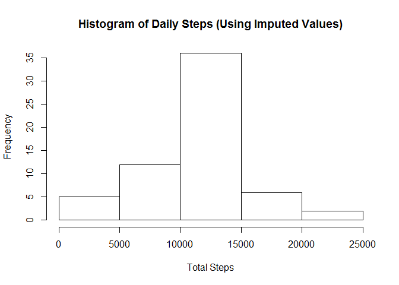
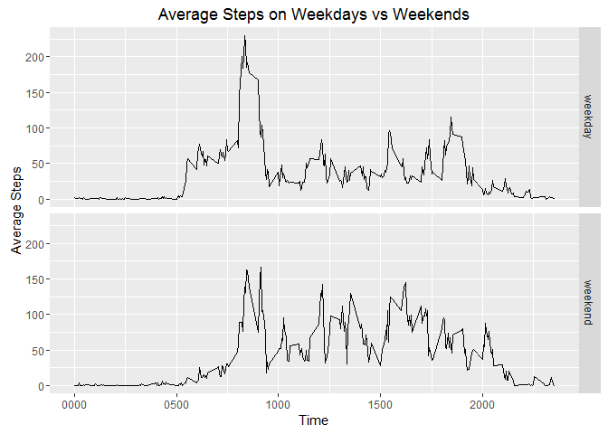

# Reproducible Research - Project 1
Johanna Baker  
June 27, 2016  


```r
options(scipen = 6)
library(dplyr)
library(ggplot2)
```


#### 1. Load the data:


```r
activity <- read.csv("activity.csv")
```


#### 2. Total number of steps taken per day


```r
dailySteps <- summarise(group_by(activity, date), total = sum(steps))
hist(dailySteps$total, main="Histogram of Total Steps per Day", xlab = "Total Steps")
```

<!-- -->

```r
meanSteps <- round(mean(dailySteps$total, na.rm=TRUE), 2)
medianSteps <- median(dailySteps$total, na.rm = TRUE)
```

Mean daily steps: 10766.19  
Median daily steps: 10765

#### 3. Average daily activity pattern


```r
intervalSteps <- activity %>%
  group_by(interval) %>%
  summarise(average = mean(steps, na.rm = TRUE))

ggplot(intervalSteps, aes(x=interval, y=average)) + geom_line() +
  labs(title="Average Steps per 5 Minute Interval", x="Time", y="Average Steps") +
  scale_x_continuous(labels=function(x) sprintf("%04d",x))
```

<!-- -->

```r
maxSteps <- intervalSteps$interval[intervalSteps$average == max(intervalSteps$average)]
maxSteps <- format(strptime(sprintf("%04d",maxSteps),"%H%M"), "%H:%M")
```

The interval with the most steps starts at: 08:35


#### 4. Imputing missing values


```r
missing <- table(is.na(activity$steps))
```

Total missing values: 2304

Missing values will be imputed using the average steps for that interval across the data set.


```r
#impute missing values by using the mean value for that interval across all dates

intervalSteps <- activity %>%
  group_by(interval) %>%
  summarise(average = mean(steps, na.rm = TRUE))

# Create a new dataset that is equal to the original dataset but with the missing data filled in.

activity_imputed <- full_join(activity,intervalSteps, by="interval")
nasteps <- which(is.na(activity$steps))
activity_imputed$steps[nasteps] <- activity_imputed$average[nasteps]


#Make a histogram of the total number of steps taken each day 
dailySteps <- summarise(group_by(activity_imputed, date), total = sum(steps))
hist(dailySteps$total, main="Histogram of Daily Steps (Using Imputed Values)", xlab = "Total Steps")
```

<!-- -->

```r
#Calculate and report the mean and median total number of steps taken per day
#Do these values differ from the estimates from the first part of the assignment? 
#What is the impact of imputing missing data on the estimates of the total daily number of steps?

meanSteps_imputed <- round(mean(dailySteps$total, na.rm=TRUE), 2)
medianSteps_imputed <- round(median(dailySteps$total, na.rm = TRUE), 2)
```

Mean daily steps: 10766.19  
Median daily steps: 10766.19

There is minimal impact of imputing missing data on the estimates of the total daily number of steps using this method. Mean daily steps is the same with missing values removed or imputed. The median daily steps is nearly the same.


#### 5. Differences in activity patterns between weekdays and weekends


```r
# Create a new factor variable in the dataset with two levels - "weekday" and "weekend" indicating 
# whether a given date is a weekday or weekend day.
weekday <- c("Mon","Tue","Wed","Thu","Fri")
weekend <- c("Sat","Sun")

activity_imputed$dayType <- lapply(activity_imputed$date, function(x) 
  ifelse(weekdays(as.Date(x), abbreviate=TRUE) %in% weekday, "weekday", "weekend"))
activity_imputed$dayType <- factor(activity_imputed$dayType, levels = c("weekday","weekend"))

#Make a panel plot containing a time series plot of the 5-minute interval (x-axis)
# and the average number of steps taken, averaged across all weekday days or weekend days (y-axis).

intervalSteps_bydayType <- activity_imputed %>%
  group_by(interval, dayType) %>%
  summarise(average = mean(steps))

ggplot(intervalSteps_bydayType, aes(x=interval, y=average, facet=dayType)) + 
  geom_line() + facet_grid(dayType~.) +
  labs(title="Average Steps on Weekdays vs Weekends", x="Time", y="Average Steps") +
  scale_x_continuous(labels=function(x) sprintf("%04d",x))
```

<!-- -->

